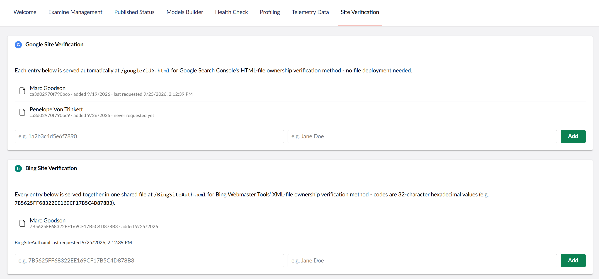

# Crumpled.VerifyOwnership

[](https://www.nuget.org/packages/Crumpled.VerifyOwnership)
[](https://www.nuget.org/packages/Crumpled.VerifyOwnership)
[](https://github.com/CrumpledDog/Crumpled.VerifyOwnership/actions/workflows/ci.yml)

Google Search Console and Bing Webmaster Tools site-ownership verification for Umbraco.

Both services' file-based verification methods normally require uploading a static file to your site's root
and leaving it there forever. This package serves those files automatically instead - configure one or more
verification entries per service and the right file starts responding immediately, with no file to deploy
or forget about. Each entry records who it belongs to and when it was added, so offboarding someone has a
clear "remove this one" action. A Settings-section backoffice panel lets admins add or remove entries at
any time, without a redeploy.


## Installation

```bash
dotnet add package Crumpled.VerifyOwnership
```

Configure under `Crumpled:VerifyOwnership` in `appsettings.json` (optional - entries can also be managed
entirely from the backoffice panel, which is seeded from this list the first time it runs):

```json
{
  "Crumpled": {
    "VerifyOwnership": {
      "Google": {
        "VerificationCodes": [
          { "Id": "1a2b3c4d5e6f7890", "PersonName": "Jane Doe (SEO Agency)" }
        ]
      },
      "Bing": {
        "VerificationCodes": [
          { "Id": "7B5625FF68322EE169CF17B5C4D878B3", "PersonName": "Jane Doe (SEO Agency)" }
        ]
      }
    }
  }
}
```

## How it works

**Google**'s [HTML-file verification method](https://support.google.com/webmasters/answer/9008080) asks you
to host a file named `google<code>.html` at your site's root, containing the single line
`google-site-verification: google<code>.html`. This package's middleware intercepts requests matching that
pattern and, if `<code>` is one of the configured verification codes, responds with the exact expected body
- nothing needs to be added to `wwwroot`.

**Bing**'s XML-file verification method asks you to host a single shared file named exactly `BingSiteAuth.xml`
(casing matters - some hosts are case-sensitive) at your site's root, listing every owner's 32-character
hexadecimal code as a `<user>` element:

```xml
<?xml version="1.0"?><users><user>7B5625FF68322EE169CF17B5C4D878B3</user></users>
```

Unlike Google's one-file-per-code method, this one file is shared across every configured Bing entry at
once - it isn't meaningfully "about" any single code, it's just a fact about the file as a whole. Codes are
stored and served with their original casing preserved (Bing's own examples use uppercase).

## Backoffice UI

A "Site Verification" panel appears under **Settings** with a section per service. The Google section lists
each entry with the code, the person it belongs to, the date it was added, and when it was last requested.
The Bing section lists entries the same way except for "last requested," which is shown once for the whole
section (e.g. "BingSiteAuth.xml last requested: ...") rather than per entry, since a single fetch of the
shared file touches every code at once. Both sections have a two-field form (code + person name) to add new
entries and a Remove action per entry. Changes take effect immediately (no restart needed).



## Last requested tracking

Each successful request for a verification file is checked against its `User-Agent` header; if it loosely
looks like the relevant crawler (`google` for Google, `bing` for Bing - the Bing check is an even less
certain heuristic than Google's, since Microsoft's own docs don't confirm `bingbot` specifically is what
fetches the verification file), the "last requested" time is updated (throttled to at most once per hour).
This is a **best-effort hint, not a verified fact** - `User-Agent` is trivially spoofable by anyone.

By default this is tracked in the same key/value row your verification entries already live in. If your
site has a distributed cache configured (e.g. Redis via `AddStackExchangeRedisCache` in your own
`Program.cs`), you can opt in to tracking through it instead:

```json
{
  "Crumpled": {
    "VerifyOwnership": {
      "UseDistributedCache": true
    }
  }
}
```

**This flag is trusted as-is - it is not auto-detected.** A registered `IDistributedCache` doesn't reliably
indicate a real, farm-wide-shared cache is configured (some dependencies register the harmless in-process
`MemoryDistributedCache` as an ambient default even when nothing has been explicitly set up), so this
package can't safely guess on your behalf. Only enable this once you've genuinely registered a real
distributed cache yourself - if you enable it without one, the site will fail to start rather than silently
falling back.

This setting only affects where the "last requested" hint is stored - **your verification entries
themselves always stay in the key/value store**, regardless of this setting. If the distributed cache is
later cleared or evicted (a Redis tier change, a restart without persistence, etc.), the only consequence is
losing recent "last requested" timestamps - they're repopulated by the next successful request, and nothing
about which codes are configured is ever affected.

## Requirements

- Umbraco CMS 17 or 18

## Contributing

See [CONTRIBUTING.md](CONTRIBUTING.md) for the branching strategy and formatting requirements.

## License

[MIT](LICENSE)
